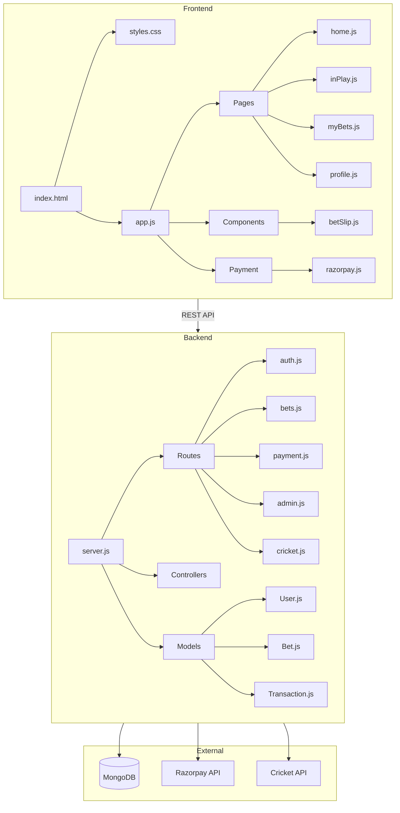
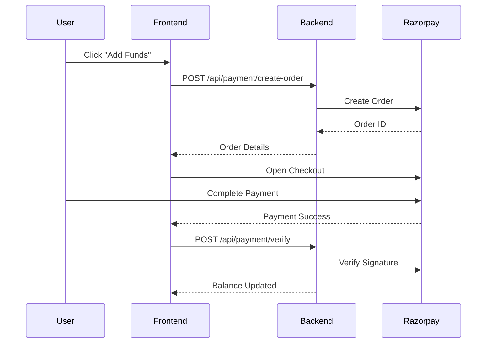

# BetSphere - Complete Project Documentation

> **Premier Cricket Betting Platform** - A modern, mobile-first web application for cricket betting with live matches, in-play betting, and integrated payment gateway.

---

## 📑 Table of Contents

1. [Project Overview](#-project-overview)
2. [System Architecture](#-system-architecture)
3. [Technology Stack](#-technology-stack)
4. [Quick Start Guide](#-quick-start-guide)
5. [Frontend Documentation](#-frontend-documentation)
6. [Backend API Documentation](#-backend-api-documentation)
7. [Database Schema](#-database-schema)
8. [Payment Integration](#-payment-integration)
9. [Authentication & Security](#-authentication--security)
10. [Deployment Guide](#-deployment-guide)
11. [Environment Variables](#-environment-variables)
12. [API Reference](#-api-reference)
13. [Troubleshooting](#-troubleshooting)

---

## 🎯 Project Overview

BetSphere is a comprehensive cricket betting platform featuring:

### ✅ Implemented Features

| Feature | Status | Description |
|---------|--------|-------------|
| **Live Matches** | ✅ | Real-time cricket match display with odds |
| **In-Play Betting** | ✅ | Place bets on live matches with dynamic odds |
| **User Authentication** | ✅ | JWT-based registration and login |
| **Bet Management** | ✅ | Track active, settled, and void bets |
| **Cash Out** | ✅ | Early settlement of active bets |
| **User Profile** | ✅ | Account management and KYC verification |
| **Payment Gateway** | ✅ | Razorpay integration for deposits |
| **Withdrawals** | ✅ | Request withdrawals with KYC verification |
| **Admin Dashboard** | ✅ | User management, bet settlement, stats |
| **Responsive Design** | ✅ | Mobile-first, optimized for all devices |

---

## 🏗 System Architecture



---

## 🛠 Technology Stack

### Frontend
| Technology | Purpose |
|------------|---------|
| HTML5 | Structure |
| CSS3 | Styling with CSS Grid/Flexbox |
| Vanilla JavaScript | Application logic |
| Inter Font | Typography |

### Backend
| Technology | Purpose |
|------------|---------|
| Node.js | Runtime environment |
| Express.js | Web framework |
| MongoDB | Database |
| Mongoose | ODM |
| JWT | Authentication |
| Bcrypt | Password hashing |

### External Services
| Service | Purpose |
|---------|---------|
| Razorpay | Payment gateway |
| MongoDB Atlas | Cloud database |
| CricAPI | Live cricket data (planned) |

---

## 🚀 Quick Start Guide

### Prerequisites
- Node.js v18+ 
- MongoDB (local or Atlas)
- npm or yarn

### 1. Clone Repository
```bash
git clone https://github.com/yash7307/betsphere.git
cd betsphere
```

### 2. Start Frontend
```bash
# Option A: Python HTTP Server
python -m http.server 3000

# Option B: Node.js serve
npx serve .

# Option C: Direct file (limited functionality)
# Simply open index.html in browser
```

Frontend available at: **http://localhost:3000**

### 3. Start Backend
```bash
cd backend

# Install dependencies
npm install

# Configure environment
cp .env.example .env
# Edit .env with your values

# Start development server
npm run dev

# OR start production server
npm start
```

Backend API at: **http://localhost:5000**

---

## 📱 Frontend Documentation

### Project Structure
```
betsphere/
├── index.html              # Main HTML entry point
├── styles.css              # Complete design system
├── js/
│   ├── app.js              # Main app & routing
│   ├── data/
│   │   ├── mockData.js     # Mock cricket data
│   │   └── matchData.js    # Match information
│   ├── utils/
│   │   └── helpers.js      # Utility functions
│   ├── components/
│   │   └── betSlip.js      # Bet slip modal
│   └── pages/
│       ├── home.js         # Home page
│       ├── myBets.js       # My Bets page
│       ├── inPlay.js       # In-Play betting
│       └── profile.js      # User profile
└── js/payment/
    ├── razorpay.js         # Razorpay integration
    └── paymentHandler.js   # Payment processing
```

### Page Components

#### Home Page (`home.js`)
- Displays live and upcoming cricket matches
- Match cards with current scores and odds
- Quick betting actions
- Featured matches section

#### In-Play Page (`inPlay.js`)
- Live match details with real-time updates
- Dynamic odds display
- Ball-by-ball commentary (planned)
- Place bets on live matches

#### My Bets Page (`myBets.js`)
- Active bets with cash-out option
- Settled bet history
- Betting statistics
- Filter by status (active/settled/void)

#### Profile Page (`profile.js`)
- User information management
- Balance display
- Deposit/Withdraw functions
- KYC verification status
- Transaction history

### Design System

#### Color Palette
```css
:root {
    --primary: #00ff87;          /* Bright Green */
    --primary-dark: #00cc6a;
    --background: #0a1f1a;       /* Dark Green */
    --surface: #122820;
    --surface-light: #1a3830;
    --text-primary: #ffffff;
    --text-secondary: #94a3b8;
    --success: #00ff87;
    --danger: #ff3b5c;
    --warning: #ffa726;
}
```

#### Typography
- **Font Family**: Inter (Google Fonts)
- **Base Size**: 14px
- **Weights**: 300, 400, 500, 600, 700, 800

### Routing System
The app uses hash-based routing:
```javascript
// Navigation
App.navigate('home');
App.navigate('inPlay', { matchId: 'BB20162' });
App.navigate('myBets');
App.navigate('profile');
```

---

## ⚙️ Backend API Documentation

### Server Configuration
```javascript
// server.js structure
- Helmet (Security headers)
- CORS (Cross-origin requests)
- Rate limiting (100 req/10 min)
- Body parsing (JSON, URL-encoded)
```

### Project Structure
```
backend/
├── server.js               # Main entry point
├── package.json
├── .env.example
├── config/
│   └── db.js               # MongoDB connection
├── models/
│   ├── User.js             # User schema
│   ├── Bet.js              # Bet schema
│   └── Transaction.js      # Transaction schema
├── controllers/
│   ├── authController.js   # Auth logic
│   ├── betController.js    # Betting logic
│   ├── paymentController.js# Payment logic
│   ├── adminController.js  # Admin logic
│   └── cricketController.js# Cricket data
├── routes/
│   ├── auth.js
│   ├── bets.js
│   ├── payment.js
│   ├── admin.js
│   └── cricket.js
└── middleware/
    └── auth.js             # JWT & role middleware
```

---

## 🗄 Database Schema

### User Model
```javascript
{
    name: String,           // Required
    email: String,          // Unique, required
    phone: String,          // Required
    password: String,       // Hashed with bcrypt
    role: String,           // 'user' | 'admin'
    balance: Number,        // Default: 0
    kycVerified: Boolean,   // Default: false
    kycDocuments: {
        panCard: String,
        aadharCard: String,
        bankAccount: Object
    },
    settings: {
        notifications: Boolean,
        twoFactorAuth: Boolean
    },
    status: String,         // 'active' | 'suspended' | 'banned'
    createdAt: Date,
    lastLogin: Date
}
```

### Bet Model
```javascript
{
    user: ObjectId,         // Reference to User
    matchId: String,
    matchName: String,
    league: String,
    teams: {
        home: String,
        away: String
    },
    selection: String,
    market: String,         // 'match_winner', 'over_under', etc.
    odds: Number,
    stake: Number,
    potentialReturn: Number,
    status: String,         // 'active' | 'won' | 'lost' | 'void' | 'cashed_out'
    result: String,
    cashOut: {
        available: Boolean,
        value: Number,
        cashedAt: Date
    },
    settledAt: Date,
    createdAt: Date
}
```

### Transaction Model
```javascript
{
    user: ObjectId,         // Reference to User
    type: String,           // 'deposit' | 'withdrawal' | 'bet' | 'win' | 'cashout'
    amount: Number,
    status: String,         // 'pending' | 'completed' | 'failed' | 'cancelled'
    paymentMethod: String,
    razorpayDetails: {
        orderId: String,
        paymentId: String,
        signature: String
    },
    withdrawalDetails: {
        accountNumber: String,
        ifscCode: String,
        accountName: String
    },
    reference: String,
    description: String,
    createdAt: Date,
    processedAt: Date
}
```

---

## 💳 Payment Integration

### Razorpay Setup

1. **Get API Keys**
   - Sign up at [razorpay.com](https://razorpay.com)
   - Navigate to Dashboard → Settings → API Keys
   - Copy Test Key ID and Secret

2. **Configure Backend**
   ```env
   RAZORPAY_KEY_ID=rzp_test_YOUR_KEY
   RAZORPAY_KEY_SECRET=YOUR_SECRET_KEY
   ```

3. **Configure Frontend**
   Update `js/payment/razorpay.js`:
   ```javascript
   config: {
       key: 'rzp_test_YOUR_KEY_HERE'
   }
   ```

### Payment Flow


### Test Cards (Razorpay Test Mode)
| Card Type | Number | CVV | Expiry |
|-----------|--------|-----|--------|
| Success | 4111 1111 1111 1111 | Any 3 digits | Any future |
| Failure | 4000 0000 0000 0002 | Any 3 digits | Any future |

---

## 🔐 Authentication & Security

### JWT Authentication

```javascript
// Login → Get Token
POST /api/auth/login
Response: { token: "eyJhbGciOiJIUzI1NiI..." }

// Use Token in Requests
Headers: { Authorization: "Bearer <token>" }
```

### Protected Routes
```javascript
// Middleware checks
1. Token validation
2. User existence
3. User status (active)
4. Role verification (for admin routes)
```

### Security Features
- ✅ Password hashing (bcrypt, 10 rounds)
- ✅ JWT expiration (7 days default)
- ✅ Rate limiting (100 req/10 min)
- ✅ Helmet security headers
- ✅ CORS configuration
- ✅ Input validation
- ✅ SQL injection prevention (MongoDB)

---

## 🌐 Deployment Guide

### Frontend Deployment (Vercel)

1. Push code to GitHub
2. Go to [vercel.com](https://vercel.com)
3. Import repository
4. Configure:
   - Framework: `Other`
   - Root Directory: `.`
   - Build Command: (leave empty)
   - Output Directory: `.`
5. Deploy

### Backend Deployment (Railway/Render)

1. Push `backend/` to repository
2. Connect to Railway/Render
3. Set environment variables
4. Configure:
   - Build Command: `npm install`
   - Start Command: `npm start`
5. Deploy

### Production Checklist
- [ ] Set `NODE_ENV=production`
- [ ] Use MongoDB Atlas for database
- [ ] Enable Razorpay live mode
- [ ] Configure proper CORS origins
- [ ] Set strong JWT secret
- [ ] Enable SSL/HTTPS
- [ ] Set up monitoring (PM2, etc.)

---

## 🔧 Environment Variables

### Backend (.env)
```env
# Server
PORT=5000
NODE_ENV=development

# Database
MONGODB_URI=mongodb://localhost:27017/betsphere

# Authentication
JWT_SECRET=your-super-secret-jwt-key
JWT_EXPIRE=7d

# Razorpay
RAZORPAY_KEY_ID=rzp_test_xxx
RAZORPAY_KEY_SECRET=your_secret

# Frontend URL (for CORS)
FRONTEND_URL=http://localhost:3000

# Betting Limits
MIN_BET_AMOUNT=10
MAX_BET_AMOUNT=100000
WITHDRAWAL_MIN=100
```

---

## 📚 API Reference

### Authentication Endpoints

| Method | Endpoint | Description | Auth |
|--------|----------|-------------|------|
| POST | `/api/auth/register` | Register new user | Public |
| POST | `/api/auth/login` | User login | Public |
| GET | `/api/auth/me` | Get current user | Private |
| PUT | `/api/auth/profile` | Update profile | Private |
| PUT | `/api/auth/password` | Change password | Private |

### Betting Endpoints

| Method | Endpoint | Description | Auth |
|--------|----------|-------------|------|
| POST | `/api/bets` | Place new bet | Private |
| GET | `/api/bets` | Get user bets | Private |
| GET | `/api/bets/stats` | Get betting stats | Private |
| GET | `/api/bets/:id` | Get single bet | Private |
| POST | `/api/bets/:id/cashout` | Cash out bet | Private |

### Payment Endpoints

| Method | Endpoint | Description | Auth |
|--------|----------|-------------|------|
| POST | `/api/payment/create-order` | Create Razorpay order | Private |
| POST | `/api/payment/verify` | Verify payment | Private |
| POST | `/api/payment/withdraw` | Request withdrawal | Private+KYC |
| GET | `/api/payment/transactions` | Get transactions | Private |
| POST | `/api/payment/webhook` | Razorpay webhook | Public |

### Admin Endpoints

| Method | Endpoint | Description | Auth |
|--------|----------|-------------|------|
| GET | `/api/admin/stats` | Dashboard stats | Admin |
| GET | `/api/admin/users` | Get all users | Admin |
| PUT | `/api/admin/users/:id/status` | Update user status | Admin |
| POST | `/api/admin/bets/:id/settle` | Settle bet | Admin |
| GET | `/api/admin/withdrawals/pending` | Pending withdrawals | Admin |
| POST | `/api/admin/withdrawals/:id/process` | Process withdrawal | Admin |

### Health Check
```bash
curl http://localhost:5000/api/health
```

---

## 🐛 Troubleshooting

### Common Issues

#### MongoDB Connection Error
```
Error: connect ECONNREFUSED
```
**Solution:** Ensure MongoDB is running
```bash
# Windows
net start MongoDB

# Check if running
mongo --version
```

#### JWT Token Invalid
```
Error: Not authorized
```
**Solution:** 
- Check token is included in headers
- Token may have expired (7 days)
- Re-login to get new token

#### Razorpay Error
```
Error: Invalid key_id
```
**Solution:**
- Verify `.env` has correct keys
- Use test keys for development
- Check Razorpay dashboard for key status

#### CORS Error
```
Access-Control-Allow-Origin error
```
**Solution:**
- Update `FRONTEND_URL` in backend `.env`
- Ensure frontend URL matches exactly

---

## 📝 API Usage Examples

### Register User
```bash
curl -X POST http://localhost:5000/api/auth/register \
  -H "Content-Type: application/json" \
  -d '{
    "name": "John Doe",
    "email": "john@example.com",
    "phone": "9876543210",
    "password": "password123"
  }'
```

### Login
```bash
curl -X POST http://localhost:5000/api/auth/login \
  -H "Content-Type: application/json" \
  -d '{
    "email": "john@example.com",
    "password": "password123"
  }'
```

### Place Bet
```bash
curl -X POST http://localhost:5000/api/bets \
  -H "Authorization: Bearer YOUR_TOKEN" \
  -H "Content-Type: application/json" \
  -d '{
    "matchId": "BB20162",
    "matchName": "India vs Australia",
    "league": "2nd ODI",
    "teams": { "home": "India", "away": "Australia" },
    "selection": "India",
    "market": "match_winner",
    "odds": 1.55,
    "stake": 500
  }'
```

---

## 📊 Admin Default Credentials

> ⚠️ **Change immediately in production!**

- **Email:** admin@betsphere.com
- **Password:** Admin@123

---

## 📄 License

This is a demonstration project. Ensure proper licensing and compliance with local gambling regulations before production use.

---

## 🆘 Support

For issues or questions:
1. Check this documentation
2. Review backend logs: `npm run dev`
3. Verify MongoDB connection
4. Check `.env` configuration

---

**Built with ❤️ for cricket enthusiasts**

*Last Updated: February 2026*
